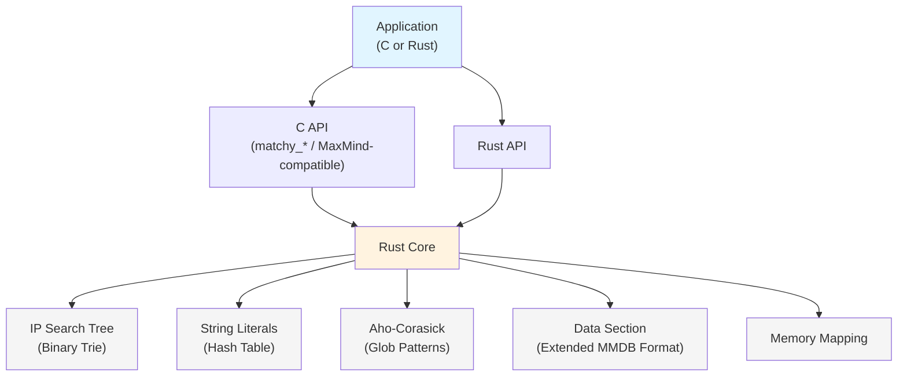

# Matchy

[](https://github.com/sethhall/matchy/actions/workflows/ci.yml)
[](LICENSE)
[](https://www.rust-lang.org/)

**Fast database for IP address and string matching with rich data storage.**

Match IP addresses, CIDR ranges, exact strings, and thousands of glob patterns (like `*.evil.com`) in microseconds. Perfect for threat intelligence, GeoIP, domain categorization, and network security applications.

## Why Matchy?

Traditional IP/domain lookups fall apart at scale:
- 🐌 Sequential pattern matching: 10,000 patterns = 10,000× slower
- 🔒 Hash tables only do exact matches—no wildcards for domains like `*.malicious.com`
- 💾 Loading databases takes hundreds of milliseconds
- 📈 Running 50 worker processes means loading the same data 50 times

**Matchy solves these problems with a unified database that supports IP addresses, exact string matches, and glob patterns.**

### Real-World Use Cases

**🛡️ Threat Intelligence**

Query malicious IPs (`1.2.3.4`), exact domains (`evil.example.com`), and glob patterns (`*.phishing-site.com`, `http://*/admin/config.php`) from a single database. Check every user interaction against 50,000+ threat indicators in microseconds.

```rust
// Check IPs, exact strings, and patterns with one database
db.lookup("1.2.3.4")?;              // IP lookup
db.lookup("evil.example.com")?;     // Exact string match
db.lookup("sub.evil.example.com")?; // Matches *.example.com pattern
```

**🌍 GeoIP with Custom Data**

Drop-in replacement for MaxMind GeoIP databases with custom metadata support. Query IP addresses and get rich JSON-like structured data:

```rust
match db.lookup("8.8.8.8")? {
    Some(QueryResult::Ip { data, prefix_len }) => {
        // data contains country, city, coordinates, etc.
        println!("Location: {:?} (/{prefix_len})", data);
    }
}
```

**📊 Multi-Process Memory Efficiency**

Run 64 worker processes with the same 100MB database? Matchy uses memory mapping so the OS automatically shares pages. **99% memory savings**: 64 processes = 100MB RAM, not 6.4GB.

**🔥 Instant Loading**

Memory-mapped databases load in <1 millisecond regardless of size. No deserialization overhead—direct access to on-disk structures.

## Key Features

### Unified Database
- **IP addresses & CIDR ranges**: Binary search tree for O(log n) lookups
- **Exact string matching**: Literal matches for domains, URLs, file paths (`evil.example.com`)
- **Glob pattern matching**: Wildcard patterns for flexible matching (`*.evil.com`, `http://*/admin/*`)
- **Auto-detection**: One query function handles all types
- **Rich data**: Store JSON-like structured data with each entry

### Performance
- **7M+ IP queries/second** on modern hardware
- **1M+ pattern queries/second** even with 50,000 glob patterns
- **<1ms loading time** via memory mapping (tested with 180M+ entries)
- **Zero-copy**: Direct access to on-disk structures
- **Memory sharing**: Automatic OS-level page sharing across processes

### Compatibility
- **MaxMind MMDB format extension**: Matchy databases use an extended MMDB format
- **Backward compatible**: IP-only `.mxy` databases work with standard MaxMind tools
- **Forward compatible**: Standard `.mmdb` files work perfectly with Matchy
- **C/Rust APIs**: Stable FFI with MaxMind-compatible C API

## Quick Start

### Rust API

```rust
use matchy::{Database, DatabaseBuilder, MatchMode, DataValue, QueryResult};
use std::collections::HashMap;

// Build a database with both IP and pattern entries
let mut builder = DatabaseBuilder::new(MatchMode::CaseSensitive);

// Add IP address with data
let mut ip_data = HashMap::new();
ip_data.insert("country".to_string(), DataValue::String("US".to_string()));
ip_data.insert("threat_level".to_string(), DataValue::String("low".to_string()));
builder.add_entry("8.8.8.8", ip_data)?;

// Add CIDR range
let mut cidr_data = HashMap::new();
cidr_data.insert("type".to_string(), DataValue::String("internal".to_string()));
builder.add_entry("10.0.0.0/8", cidr_data)?;

// Add pattern with data
let mut pattern_data = HashMap::new();
pattern_data.insert("category".to_string(), DataValue::String("malware".to_string()));
pattern_data.insert("threat_level".to_string(), DataValue::String("high".to_string()));
builder.add_entry("*.evil.com", pattern_data)?;

// Build and save
let database_bytes = builder.build()?;
std::fs::write("threats.mxy", &database_bytes)?;

// Query the database (auto-detects IP vs string vs pattern)
let db = Database::open("threats.mxy")?;

// IP lookup
match db.lookup("8.8.8.8")? {
    Some(QueryResult::Ip { data, prefix_len }) => {
        println!("IP found: {:?} (/{prefix_len})", data);
    }
    Some(QueryResult::NotFound) => println!("Not found"),
    None => println!("No IP data in database"),
}

// Pattern matching
match db.lookup("malware.evil.com")? {
    Some(QueryResult::Pattern { pattern_ids, data }) => {
        println!("Matched {} patterns", pattern_ids.len());
        for (i, d) in data.iter().enumerate() {
            if let Some(threat_data) = d {
                println!("  Pattern {}: {:?}", pattern_ids[i], threat_data);
            }
        }
    }
    Some(QueryResult::NotFound) => println!("No match"),
    None => println!("No pattern data in database"),
}
```

### C API

```c
#include "matchy.h"
#include <stdio.h>

int main() {
    // Build database
    matchy_builder_t *builder = matchy_builder_new();
    matchy_builder_add(builder, "1.2.3.4", "{\"threat\": \"high\"}");
    matchy_builder_add(builder, "*.evil.com", "{\"category\": \"malware\"}");
    matchy_builder_save(builder, "threats.mxy");
    matchy_builder_free(builder);
    
    // Query database
    matchy_t *db = matchy_open("threats.mxy");
    if (!db) {
        fprintf(stderr, "Failed to open database\n");
        return 1;
    }
    
    // Unified query - automatically detects IP vs pattern
    matchy_result_t result = matchy_query(db, "1.2.3.4");
    if (result.found && result.data_json) {
        printf("Found: %s\n", result.data_json);
        if (result.prefix_len > 0) {
            printf("CIDR prefix: /%d\n", result.prefix_len);
        }
        matchy_free_result(&result);
    }
    
    // Query pattern
    result = matchy_query(db, "malware.evil.com");
    if (result.found && result.data_json) {
        printf("Pattern match: %s\n", result.data_json);
        matchy_free_result(&result);
    }
    
    matchy_close(db);
    return 0;
}
```

## Building Databases

Matchy provides a command-line tool to build databases (`.mxy` files) from various input formats. The tool automatically detects whether entries are IP addresses, CIDR ranges, exact string literals, or glob patterns.

**Note:** Matchy databases use the `.mxy` extension to distinguish them from standard MaxMind `.mmdb` files. While the format is based on and compatible with MMDB, the `.mxy` extension signals that the database may contain string and pattern matching features not available in standard MMDB readers.

### Installation

```bash
cargo install --path .
# Or run directly:
cargo build --release
./target/release/matchy --help
```

### Input Formats

#### Text Format (Simple - No Metadata)

One entry per line. Supports IP addresses, CIDR ranges, and glob patterns. Lines starting with `#` are comments. Perfect for simple blocklists or allowlists.

**Example: `entries.txt`**
```text
# IP addresses
8.8.8.8
1.1.1.1

# CIDR ranges
10.0.0.0/8
192.168.0.0/16

# Glob patterns
*.malicious.com
*.phishing-site.com
http://*/admin/config.php
```

**Build command:**
```bash
matchy build -o database.mxy entries.txt
```

#### CSV Format (With Metadata)

CSV file with headers. The first column must be named `entry` (or `key`) and contains the IP/CIDR/pattern. All other columns become metadata fields. Values are automatically typed as numbers, booleans, or strings.

**Example: `threats.csv`**
```csv
entry,threat_level,category,first_seen,blocked
1.2.3.4,high,malware,2025-01-01,true
10.0.0.0/8,low,internal,2024-12-15,false
*.evil.com,critical,phishing,2025-01-10,true
malware.example.com,high,malware,2025-01-05,true
http://*/admin/config.php,medium,scanning,2024-11-20,false
```

**Build command:**
```bash
matchy build -o threats.mxy --format csv threats.csv
```

**Example: `geoip.csv`**
```csv
entry,country,city,latitude,longitude
8.8.8.0/24,US,Mountain View,37.386,-122.084
1.1.1.0/24,AU,Sydney,-33.868,151.209
185.199.108.0/22,US,San Francisco,37.774,-122.419
```

```bash
matchy build -o geoip.mxy --format csv \
  --database-type "GeoIP-Lite" \
  --description "Custom GeoIP database" \
  geoip.csv
```

#### Controlling Entry Type (Optional)

By default, Matchy automatically detects whether entries are IP addresses, literal strings, or glob patterns. In most cases, this works perfectly. However, for edge cases where you need explicit control, you can use type prefixes:

| Prefix | Purpose | Example |
|--------|---------|----------|
| `literal:` | Force exact string matching | `literal:*.actually-in-domain.com` |
| `glob:` | Force glob pattern matching | `glob:test.com` |
| `ip:` | Force IP address parsing | `ip:10.0.0.0/8` |

**When you might need this:**

- **Domain names with wildcard characters**: If a domain literally contains `*`, `?`, or `[` characters
  ```csv
  entry,category,note
  literal:*.cdn.example.com,infrastructure,Asterisk is part of the domain name
  literal:file[1].txt,testing,Brackets are literal characters
  ```

- **Testing glob behavior**: Force glob matching without wildcards
  ```csv
  entry,category,note
  glob:test.com,testing,Force glob even without wildcards
  ```

- **Explicit IP parsing**: Rarely needed, but available
  ```csv
  entry,category,note
  ip:192.168.1.0/24,network,Explicitly marked as IP
  ```

**Example CSV with prefixes:**
```csv
entry,threat_level,category,notes
# Normal entries - auto-detected
evil.example.com,high,malware,Exact string match
*.phishing.com,critical,phishing,Glob pattern (has wildcard)
1.2.3.4,high,scanner,IP address

# Edge cases - explicit prefixes
literal:*.weird-domain.com,medium,suspicious,Domain contains literal asterisk
glob:no-wildcards.com,low,test,Force glob matching for testing
```

**Example JSON with prefixes:**
```json
[
  {"key": "evil.example.com", "data": {"note": "auto-detected literal"}},
  {"key": "*.phishing.com", "data": {"note": "auto-detected glob"}},
  {"key": "literal:*.in-domain.com", "data": {"note": "forced literal"}},
  {"key": "glob:test.com", "data": {"note": "forced glob"}}
]
```

**Note:** The prefix is stripped before storage, so queries use the actual key without the prefix.

#### JSON Format (With Complex Metadata)

JSON array with entries containing a `key` (IP/CIDR/pattern) and optional `data` (arbitrary JSON object). Use this for nested data structures or arrays.

**Example: `threats.json`**
```json
[
  {
    "key": "1.2.3.4",
    "data": {
      "threat_level": "high",
      "category": "malware",
      "first_seen": "2025-01-01",
      "tags": ["botnet", "ddos"],
      "attribution": {
        "actor": "Storm-0558",
        "confidence": 0.85
      }
    }
  },
  {
    "key": "10.0.0.0/8",
    "data": {
      "type": "internal",
      "description": "Private network range"
    }
  },
  {
    "key": "*.evil.com",
    "data": {
      "threat_level": "critical",
      "category": "phishing",
      "blocked": true
    }
  }
]
```

**Build command:**
```bash
matchy build -o threats.mxy --format json threats.json
```

#### MISP Format (Threat Intelligence)

MISP (Malware Information Sharing Platform) JSON format for threat intelligence feeds. The tool automatically extracts IP addresses, domains, and URLs with their associated threat data.

**Build command:**
```bash
matchy build -o threats.mxy --format misp ./misp-exports/*.json
```

### Build Options

```bash
matchy build [OPTIONS] <INPUT>... -o <OUTPUT>

Options:
  -o, --output <FILE>          Output database file (.mxy extension)
  -f, --format <FORMAT>        Input format: text, csv, json, or misp [default: text]
  -t, --database-type <TYPE>   Database type name (e.g., "MyCompany-ThreatIntel")
  -d, --description <TEXT>     Description text
      --desc-lang <LANG>       Language code for description [default: en]
  -v, --verbose                Verbose output during build
```

### Multiple Input Files

You can specify multiple input files to combine entries:

```bash
# Combine multiple text files
matchy build -o combined.mxy ips.txt domains.txt urls.txt

# Combine multiple CSV files
matchy build -o threats.mxy --format csv threats1.csv threats2.csv threats3.csv

# Combine multiple JSON files
matchy build -o threats.mxy --format json threat1.json threat2.json threat3.json

# Combine multiple MISP exports
matchy build -o misp-threats.mxy --format misp ./misp-exports/*.json
```

### Examples

**Simple blocklist (no metadata):**
```bash
# Just match IPs and domains, no data attached
matchy build -o blocklist.mxy blocklist.txt
```

**Threat intelligence database with metadata:**
```bash
matchy build -o threats.mxy --format csv \
  --database-type "ThreatIntel" \
  --description "Combined IP and domain threat indicators" \
  --verbose \
  threats.csv
```

**GeoIP-style database:**
```bash
matchy build -o geoip.mxy --format csv \
  --database-type "GeoIP-Lite" \
  --description "Custom GeoIP database" \
  geoip.csv
```

**Build from MISP export:**
```bash
matchy build -o misp-threats.mxy --format misp --verbose \
  ./misp-exports/*.json
```

### Querying Databases

Once built, query your database using the CLI:

```bash
# Query an IP address
matchy query threats.mxy 1.2.3.4
# Output: [{"threat_level":"high","category":"malware","first_seen":"2025-01-01","blocked":true}]

# Query a domain (exact match or pattern matching)
matchy query threats.mxy evil.malicious.com
# Output: [{"threat_level":"critical","category":"phishing","blocked":true}]

# Query with no match returns empty array
matchy query threats.mxy benign.example.com
# Output: []

# Quiet mode (exit code only: 0=found, 1=not found)
matchy query threats.mxy 1.2.3.4 --quiet
echo $?  # 0 if found, 1 if not found
```

### Inspecting Databases

View database information and statistics:

```bash
# Human-readable output
matchy inspect threats.mxy

# JSON output
matchy inspect threats.mxy --json

# Verbose output with full metadata
matchy inspect threats.mxy --verbose
```

**Example output:**
```
Database: threats.mxy
Format:   Combined IP+String database

Capabilities:
  IP lookups:      ✓
    Entries:       1,234
  String lookups:  ✓
    Literals:      ✓ (567 strings)
    Globs:         ✓ (890 patterns)

Metadata:
  Database type:   ThreatIntel
  Description:
    en: Combined IP and domain threat indicators
  Build time:      2025-01-15 10:30:45 UTC (1736936445)
```

## Security

### Trust Mode for Performance

Matchy provides two database loading modes:

**Safe Mode (Default)** - Validates UTF-8 on every pattern string read
- Use for databases from untrusted or external sources
- Prevents undefined behavior from malicious databases
- Performance: baseline

**Trusted Mode** - Skips UTF-8 validation for better performance
- **~15-20% faster** for pattern-heavy workloads
- **Only use for databases you built yourself or trust completely**
- Undefined behavior if database contains invalid UTF-8

#### Using Trusted Mode

**Rust API:**
```rust
// Safe mode (default) - for external databases
let db = Database::open("external-threats.mxy")?;

// Trusted mode - only for databases you control
let db = Database::open_trusted("my-threats.mxy")?;
```

**C API:**
```c
// Safe mode (default)
matchy_t *db = matchy_open("external.mxy");

// Trusted mode - faster but ONLY for trusted sources
matchy_t *db = matchy_open_trusted("my-database.mxy");
```

**CLI:**
```bash
# Safe mode
./matchy bench pattern --count 200000

# Trusted mode - 28% faster
./matchy bench pattern --count 200000 --trusted
```

**Security Recommendation:** Always use safe mode (default) unless you control the database build process and can guarantee its integrity.

## Performance

All benchmarks measured on M4 MacBook Air (2024). See [DEVELOPMENT.md](./DEVELOPMENT.md) for comprehensive benchmarks and analysis.

### IP Lookups

| Database Size | Build Rate | Load Time | Query Throughput | Avg Latency |
|--------------|------------|-----------|------------------|-------------|
| 10K IPs | 2.65M/sec | 0.34ms | **4.00M q/s** | 0.25µs |
| 100K IPs | 2.78M/sec | 0.72ms | **3.87M q/s** | 0.26µs |

### String Literal Matching

| Database Size | Build Rate | Load Time | Query Throughput | Avg Latency | Hit Rate |
|--------------|------------|-----------|------------------|-------------|----------|
| 10K strings | 1.96M/sec | 0.91ms | **1.14M q/s** | 0.88µs | 10% |
| 100K strings | 2.31M/sec | 0.94ms | **165K q/s** | 6.07µs | 10% |

### Pattern Matching (Glob Patterns)

Performance varies dramatically by pattern complexity:

| Pattern Style | 1K Patterns | 10K Patterns | 50K Patterns |
|--------------|-------------|--------------|-------------|
| **Suffix** (`*.domain.com`) | 3.38M q/s | **3.08M q/s** | **3.32M q/s** |
| **Mixed** (50% prefix/suffix) | 1.96M q/s | **1.95M q/s** | **1.98M q/s** |
| **Prefix** (`error-*`) | 939K q/s | **956K q/s** | **956K q/s** |
| **Complex** (multi-wildcard) | 429K q/s | **59K q/s** | **12.7K q/s** |

**Key Insights:** 
- Simple suffix patterns like `*.malicious-domain.com` are **52× faster** than complex patterns with multiple wildcards
- Suffix patterns maintain **~3M q/s** regardless of database size (1K-50K patterns)
- Prefix patterns stay near **1M q/s** across all scales
- Mixed workloads (50% prefix, 50% suffix) deliver **2M q/s** consistently

### Load Time

**<1ms load time** regardless of database size thanks to memory-mapped zero-copy access:
- 10K entries: 0.34-0.91ms
- 100K entries: 0.72-0.94ms  
- Instant loading enables hot-reload of threat feeds

### Memory Efficiency

**99% memory savings** in multi-process environments:
- Traditional: 50 processes × 100MB = 5GB RAM
- Matchy (mmap): 50 processes sharing 100MB = **100MB RAM**

## Architecture



**Unified approach**: 
- **IP addresses**: Binary search tree for O(log n) lookups
- **Exact strings**: Hash table for O(1) literal matching (internal optimization)
- **Glob patterns**: Aho-Corasick automaton for O(n) simultaneous pattern matching
- **Data storage**: Extended MMDB format with automatic deduplication
- **Loading**: Memory-mapped for instant access and cross-process sharing

## Building

**Requirements:**
- Rust 1.70+ (stable toolchain)
- C compiler (for C API consumers)
- cbindgen (installed automatically as build dependency)

```bash
# Build optimized library
cargo build --release

# Run test suite
cargo test

# Run benchmarks
cargo bench

# Generate API documentation
cargo doc --no-deps --open
```

The build process automatically generates `include/matchy.h` for C/C++ integration.

**Build artifacts:**
- `target/release/libmatchy.dylib` (macOS)
- `target/release/libmatchy.so` (Linux)
- `target/release/libmatchy.a` (static library)
- `include/matchy/matchy.h` (C API header, auto-generated)
- `include/matchy/maxminddb.h` (MaxMind-compatible C API header, auto-generated)

## API Reference

### C API Functions

**Builder API:**
- `matchy_builder_t* matchy_builder_new()` - Create database builder
- `int matchy_builder_add(builder, key, json_data)` - Add IP/CIDR/pattern with JSON data
- `int matchy_builder_set_description(builder, desc)` - Set metadata
- `int matchy_builder_save(builder, filename)` - Build and save to file
- `int matchy_builder_build(builder, &buffer, &size)` - Build to memory
- `void matchy_builder_free(builder)` - Free builder

**Query API:**
- `matchy_t* matchy_open(filename)` - Open database (memory-mapped, safe mode)
- `matchy_t* matchy_open_trusted(filename)` - Open database (trusted mode, faster but only for trusted sources)
- `matchy_t* matchy_open_buffer(buffer, size)` - Open from memory buffer
- `void matchy_close(db)` - Close database
- `matchy_result_t matchy_query(db, query)` - **Unified query** (auto-detects IP vs pattern)
- `void matchy_free_result(&result)` - Free query result
- `const char* matchy_version()` - Get library version

**Error Codes:**
- `MATCHY_SUCCESS` (0) - Success
- `MATCHY_ERROR_FILE_NOT_FOUND` (-1) - File not found
- `MATCHY_ERROR_INVALID_FORMAT` (-2) - Invalid database format
- `MATCHY_ERROR_INVALID_PARAM` (-5) - Invalid parameter
- `MATCHY_ERROR_IO` (-6) - I/O error

### Rust API

**Core Types:**
- `Database` - Unified database for queries
- `DatabaseBuilder` - Build databases (alias for `MmdbBuilder`)
- `QueryResult` - Result enum (IP/Pattern/NotFound)
- `DataValue` - Rich data type (String/Int/Map/Array/etc.)

See [API documentation](https://docs.rs/matchy) for complete reference.

## Linking

```bash
# C programs
gcc -o app app.c -L./target/release -lmatchy -lpthread -ldl -lm

# C++ programs
g++ -o app app.cpp -L./target/release -lmatchy -lpthread -ldl -lm

# Add to rpath (macOS)
install_name_tool -add_rpath @executable_path/. app

# Add to rpath (Linux)
export LD_LIBRARY_PATH=./target/release:$LD_LIBRARY_PATH
```

## Database Format

Matchy databases (`.mxy` files) use an extended MMDB format:

```
┌──────────────────────────────────────┐
│  MMDB Metadata Section               │  ← Database info, type, description
├──────────────────────────────────────┤
│  IP Search Tree (binary trie)        │  ← MMDB-standard IP lookups
├──────────────────────────────────────┤
│  Data Section (MMDB format)          │  ← Shared rich data storage
├──────────────────────────────────────┤
│  String Literals (hash table)        │  ← Extension: exact string matching
├──────────────────────────────────────┤
│  Glob Patterns (Aho-Corasick)        │  ← Extension: wildcard matching
└──────────────────────────────────────┘
```

**Compatibility:**
- IP-only databases created by Matchy can be read by standard MaxMind tools
- Standard `.mmdb` files work perfectly with Matchy
- String/pattern sections are Matchy extensions—gracefully ignored by standard readers
- All structures use file offsets (not pointers) enabling:
  - Direct memory mapping without deserialization
  - Cross-process page sharing via shared memory
  - Safe zero-copy access with validation

## String Matching

Matchy supports two types of string matching:

### Exact String Matching (Literals)
Direct string comparisons for precise matches:
- `evil.example.com` - Only matches exactly this domain
- `http://evil.com/malware.exe` - Matches only this exact URL
- Best for known bad domains, file paths, or specific indicators

**Performance:** O(1) hash table lookup (internal optimization)

### Glob Pattern Matching (Wildcards)
Flexible wildcard patterns for families of matches:
- `*` - Match zero or more characters
- `?` - Match exactly one character  
- `[abc]` - Match any character in set
- `[a-z]` - Match any character in range
- `[!abc]` - Match any character not in set

**Examples:**
- `*.evil.com` - Matches `www.evil.com`, `malware.evil.com`
- `test_*.log` - Matches `test_001.log`, `test_debug.log`
- `http://*/admin/*` - Matches any URL with `/admin/` path

**Performance:** O(n) Aho-Corasick simultaneous matching across all patterns

### Auto-Detection vs Explicit Control

**Auto-detection (default):** The database builder automatically determines whether a string is a literal or pattern based on the presence of wildcard characters (`*`, `?`, `[`). This works for 99% of use cases.

**Explicit control (edge cases):** For strings that literally contain wildcard characters or when you need to force a specific type, use prefixes:
- `literal:*.domain.com` - Force literal matching (asterisk is part of the domain)
- `glob:test.com` - Force glob matching (no wildcards, but treat as pattern)
- `ip:192.168.1.0/24` - Force IP parsing (rarely needed)

See [Controlling Entry Type](#controlling-entry-type-optional) for detailed examples.

## Documentation

- [API_REDESIGN.md](./API_REDESIGN.md) - Complete API specification
- [DEVELOPMENT.md](./DEVELOPMENT.md) - Architecture and implementation details
- [examples/](./examples/) - Example programs
- API docs: `cargo doc --no-deps --open`

## Testing

```bash
cargo test              # Run test suite
cargo test -- --nocapture  # With output
cargo bench             # Run benchmarks
```

## Contributing

Contributions welcome! Please:
- Run `cargo fmt` and `cargo clippy` before submitting
- Ensure all tests pass with `cargo test`
- Add tests for new features
- Update documentation


## License

BSD-2-Clause

## Acknowledgments

Matchy represents the evolution of decades of network security data matching experience:

In 2007, I integrated [libmaxminddb](https://github.com/maxmind/libmaxminddb) into [Zeek](https://zeek.org) (then called Bro) for GeoIP enrichment—adding location data to network logs proved invaluable for detection and analysis. Fast forward to the early 2010s, I developed Zeek's Intelligence Framework to efficiently match threat indicators against network traffic. It handled IP addresses and exact string matches well, but had limitations: glob pattern matching wasn't possible, and memory consumption was problematic since every Zeek worker process needed its own copy of the data.

Years later, an intern at the Zeek project created [Paraglob](https://github.com/zeek/paraglob), bringing efficient multi-pattern glob matching to Zeek. I began modifying Paraglob to use memory-mapped structures instead of heap memory, enabling instant loading and automatic sharing between processes. During this work, I realized these pieces—IP matching, string matching, pattern matching, and rich data storage—could be unified into a single, efficient database format.

Matchy is that unification: it extends MaxMind's MMDB format with Paraglob's pattern matching algorithm, creating a database that handles IPs, exact strings, and glob patterns with memory efficiency and performance that scales to hundreds of worker processes. The result maintains backward compatibility with the MaxMind ecosystem while adding capabilities that make it suitable for modern threat intelligence and network security applications.
