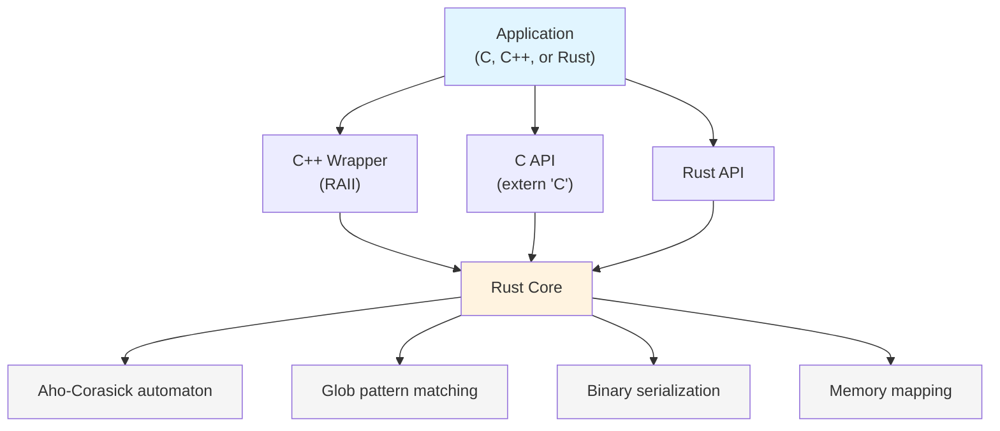

# paraglob-rs

[](https://github.com/sethhall/paraglob-rs/actions/workflows/ci.yml)
[](LICENSE)
[](https://www.rust-lang.org/)

Fast multi-pattern glob matching with zero-copy memory-mapped databases. Match thousands of patterns against strings in microseconds with automatic memory sharing across processes.

## Why paraglob-rs?

Imagine you're building a security system that needs to check every incoming request against a threat intelligence feed. Or a log processing pipeline that routes millions of events to different destinations based on their content. Or a web application firewall that blocks suspicious URLs.

The challenge? **You have thousands of patterns to match, and you need answers in microseconds.**

Traditional approaches fall apart at scale:
- 🐌 Regex libraries check patterns one-by-one: 10,000 patterns = 10,000× slower
- 🔒 Hash tables only do exact matches—no wildcards for domains like `*.malicious.com`
- 💾 Loading pattern databases takes hundreds of milliseconds
- 📈 Running 50 worker processes means loading the same patterns 50 times

paraglob-rs was built to solve these problems.

### Real-World Problems It Solves

**🛡️ Threat Intelligence at Scale**

You maintain feeds of malicious domains (`*.phishing-site.com`), suspicious URL patterns (`http://*/admin/config.php`), and known-bad email senders (`*@spam-domain.org`). Your security layer needs to check every user interaction against 10,000+ threat indicators—without adding latency.

**Problem**: Checking patterns sequentially would take milliseconds per request. Unacceptable.

**Solution**: paraglob-rs compiles all patterns into a single automaton and checks them in one pass. Result: ~20 microseconds per check, even with 50,000 patterns.

---

**📊 Log Routing & Classification**

Your infrastructure generates millions of log lines per minute. Security logs containing `*authentication failed*` or `*/etc/passwd*` go to your SIEM. Performance logs with `*slow query*` or `*timeout*` go to your metrics system. Application errors route to your alerting platform.

**Problem**: You can't afford to scan each log line multiple times, and you can't load the same routing rules into memory for every worker process.

**Solution**: paraglob-rs's memory-mapped databases load in <100 microseconds and share physical memory across all workers. 50 processes use the same RAM as one.

---

**🔥 Multi-Process Memory Efficiency**

You run network monitoring software like Zeek with 24 worker processes, each needing the same threat intelligence patterns. Or an Nginx deployment with 64 worker processes, each enforcing the same access control rules.

**Problem**: Traditional approaches load the pattern database 24 or 64 times. A 100MB pattern set becomes 2.4GB or 6.4GB of RAM.

**Solution**: paraglob-rs uses memory mapping. The operating system automatically shares pages across processes. 64 processes = 100MB of RAM, not 6.4GB. That's **99% memory savings**.

---

**🔐 Web Application Firewall Rules**

You need to block SQL injection attempts (`*' OR '1'='1*`), path traversal (`*/../etc/*`), XSS patterns (`*<script>*`), and thousands of other attack signatures—on every HTTP request, without impacting response times.

**Problem**: You need comprehensive protection, but every millisecond of latency costs you user experience and money.

**Solution**: paraglob-rs processes requests in the hot path with <20 microseconds overhead. Your WAF becomes effectively invisible to users while remaining comprehensive.

---

### What Makes It Fast

paraglob-rs uses the Aho-Corasick algorithm to build a finite automaton that matches all patterns simultaneously:

- **O(n) time complexity**: Scan the input once, match thousands of patterns in parallel. Adding more patterns doesn't slow down matching.
- **Zero-copy loading**: Memory-mapped databases load in <100 microseconds—no parsing, no deserialization.
- **Automatic memory sharing**: The OS shares physical memory pages across all processes that map the same file.
- **1M+ queries/second**: Even with 50,000 patterns (measured on M4 MacBook Air).

## When Should You Use This?

You'll benefit from paraglob-rs if:

✅ You need to match hundreds or thousands of patterns against strings  
✅ Performance matters—you're in a hot path or high-throughput scenario  
✅ Your patterns include wildcards (`*`, `?`, `[abc]`) not just exact matches  
✅ You run multiple processes that need the same pattern sets  
✅ You need to load pattern databases quickly (initialization time matters)  

Common applications: threat intelligence, log processing, WAF rules, access control, content classification, data routing, network security monitoring.

## Performance

Measured on M4 MacBook Air:

| Workload | Throughput | Notes |
|----------|------------|-------|
| Large sets (10K patterns) | 1.4M queries/sec | High-volume filtering |
| Very large sets (50K patterns) | 1M queries/sec | Extreme scale |
| Database load time | <100μs | Zero-copy mmap |
| Build time (42 patterns) | ~0.3ms | Typical application |

See [DEVELOPMENT.md](./DEVELOPMENT.md) for detailed benchmarks and implementation notes.

## Architecture

The library exposes three API layers:



**Design rationale:** The Rust core provides memory safety and idiomatic error handling. The C API uses opaque handles and integer error codes for FFI stability. The optional C++ wrapper adds RAII semantics for C++ consumers.

## Building

**Requirements:**
- Rust 1.70+ (stable toolchain)
- C compiler (for C API consumers)
- cbindgen (installed automatically as build dependency)

```bash
# Build optimized library
cargo build --release

# Run test suite
cargo test

# Run benchmarks
cargo bench

# Generate API documentation
cargo doc --no-deps --open
```

The build process automatically generates `include/paraglob_rs.h` for C/C++ integration.

## Usage

### Rust

```rust
use paraglob_rs::Paraglob;

// Build pattern database in memory
let patterns = vec!["*.txt", "*.log", "data_*"];
let pg = Paraglob::new(patterns)?;

// Find all matching patterns
let matches = pg.find_all("data_file.txt")?;
// Returns: ["*.txt", "data_*"]

// Serialize to disk
paraglob_rs::save(&pg, "patterns.pgb")?;

// Load with zero-copy memory mapping
let pg = paraglob_rs::load("patterns.pgb")?;
```

### C

```c
#include "paraglob_rs.h"

// Memory-map database from disk
paraglob_db_t* db = paraglob_open_mmap("patterns.pgb");
if (!db) { /* handle error */ }

// Find matches
size_t count = 0;
int* match_ids = paraglob_find_all(db, "test.txt", &count);

// Clean up
paraglob_free_results(match_ids);
paraglob_close(db);
```

### C++

```cpp
#include "paraglob_rs.hpp"

// RAII wrapper handles lifetime
paraglob::Paraglob pg({"*.txt", "*.log", "data_*"});
auto matches = pg.get("data_file.txt");
```

### Linking

```bash
# C/C++ programs
gcc -o app app.c -L./target/release -lparaglob_rs -lpthread -ldl -lm
g++ -o app app.cpp -L./target/release -lparaglob_rs -lpthread -ldl -lm
```

## Technical Details

### Glob Pattern Support

Supported glob syntax:
- `*` - Match zero or more characters
- `?` - Match exactly one character  
- `[abc]` - Match any character in set
- `[a-z]` - Match any character in range
- `[!abc]` - Match any character not in set

### Implementation Notes

The core algorithm compiles glob patterns into an Aho-Corasick automaton:
1. Extract literal prefixes from each pattern
2. Build AC automaton from literals with failure links
3. On match, verify full glob pattern against input
4. Continue automaton traversal after failure links for overlapping matches

All data structures use file offsets instead of pointers, enabling:
- Direct memory mapping without deserialization
- Cross-process page sharing via shared memory
- Validation of all offsets before dereferencing (safety)

### Binary Format

The `.pgb` file format uses `#[repr(C)]` structures for C++ compatibility:
- Magic bytes: `PARAGLOB`
- Version header with offsets to node/edge tables
- Offset-based AC automaton nodes and edges
- Pattern metadata with type flags (literal vs glob)

Files generated by Rust can be read by C++ and vice versa.

## Documentation

- [DEVELOPMENT.md](./DEVELOPMENT.md) - Architecture, benchmarks, and design decisions
- [examples/README.md](./examples/README.md) - Example programs
- API docs: `cargo doc --no-deps --open`

## Testing

```bash
cargo test              # Run test suite (79 tests)
cargo test -- --nocapture  # With output
cargo bench             # Run benchmarks
```

## Contributing

Contributions are welcome! Please see [CONTRIBUTING.md](./CONTRIBUTING.md) for guidelines.

Before submitting a PR:
- Run `cargo fmt` and `cargo clippy`
- Ensure all tests pass with `cargo test`
- Add tests for new features
- Update documentation as needed

## License

BSD-2-Clause

## Acknowledgments

Rust port of the original paraglob C++ library with changes for mmap-ing databases.