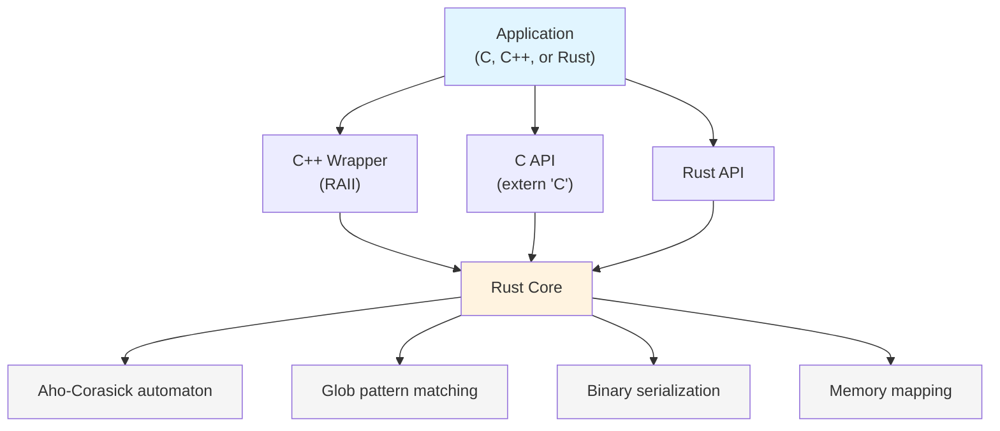

# paraglob-rs

Fast multi-pattern glob matching with zero-copy memory-mapped databases. A Rust implementation providing O(n) pattern matching through Aho-Corasick automata, with APIs for Rust, C, and C++.

## Overview

paraglob-rs enables efficient matching of thousands of glob patterns against arbitrary strings in a single pass. The implementation uses offset-based data structures that can be directly memory-mapped from disk, eliminating deserialization overhead and enabling cross-process memory sharing.

**Key characteristics:**
- O(n) time complexity for matching n input characters, regardless of pattern count
- Sub-millisecond database loading via memory mapping
- 99% memory reduction in multi-process scenarios through shared pages
- Binary format compatible with the original C++ implementation
- Pure Rust core with stable C FFI and optional C++ wrapper

## Performance

Measured on Apple M1:

| Workload | Throughput | Notes |
|----------|------------|-------|
| Large sets (10K patterns) | 1.4M queries/sec | High-volume filtering |
| Very large sets (50K patterns) | 1M queries/sec | Extreme scale |
| Database load time | <100μs | Zero-copy mmap |
| Build time (42 patterns) | ~0.3ms | Typical application |

See [DEVELOPMENT.md](./DEVELOPMENT.md) for detailed benchmarks and implementation notes.

## Architecture

The library exposes three API layers:



**Design rationale:** The Rust core provides memory safety and idiomatic error handling. The C API uses opaque handles and integer error codes for FFI stability. The optional C++ wrapper adds RAII semantics for C++ consumers.

## Building

**Requirements:**
- Rust 1.70+ (stable toolchain)
- C compiler (for C API consumers)
- cbindgen (installed automatically as build dependency)

```bash
# Build optimized library
cargo build --release

# Run test suite
cargo test

# Run benchmarks
cargo bench

# Generate API documentation
cargo doc --no-deps --open
```

The build process automatically generates `include/paraglob_rs.h` for C/C++ integration.

## Usage

### Rust

```rust
use paraglob_rs::Paraglob;

// Build pattern database in memory
let patterns = vec!["*.txt", "*.log", "data_*"];
let pg = Paraglob::new(patterns)?;

// Find all matching patterns
let matches = pg.find_all("data_file.txt")?;
// Returns: ["*.txt", "data_*"]

// Serialize to disk
paraglob_rs::save(&pg, "patterns.pgb")?;

// Load with zero-copy memory mapping
let pg = paraglob_rs::load("patterns.pgb")?;
```

### C

```c
#include "paraglob_rs.h"

// Memory-map database from disk
paraglob_db_t* db = paraglob_open_mmap("patterns.pgb");
if (!db) { /* handle error */ }

// Find matches
size_t count = 0;
int* match_ids = paraglob_find_all(db, "test.txt", &count);

// Clean up
paraglob_free_results(match_ids);
paraglob_close(db);
```

### C++

```cpp
#include "paraglob_rs.hpp"

// RAII wrapper handles lifetime
paraglob::Paraglob pg({"*.txt", "*.log", "data_*"});
auto matches = pg.get("data_file.txt");
```

### Linking

```bash
# C/C++ programs
gcc -o app app.c -L./target/release -lparaglob_rs -lpthread -ldl -lm
g++ -o app app.cpp -L./target/release -lparaglob_rs -lpthread -ldl -lm
```

## Technical Details

### Glob Pattern Support

Supported glob syntax:
- `*` - Match zero or more characters
- `?` - Match exactly one character  
- `[abc]` - Match any character in set
- `[a-z]` - Match any character in range
- `[!abc]` - Match any character not in set

### Implementation Notes

The core algorithm compiles glob patterns into an Aho-Corasick automaton:
1. Extract literal prefixes from each pattern
2. Build AC automaton from literals with failure links
3. On match, verify full glob pattern against input
4. Continue automaton traversal after failure links for overlapping matches

All data structures use file offsets instead of pointers, enabling:
- Direct memory mapping without deserialization
- Cross-process page sharing via shared memory
- Validation of all offsets before dereferencing (safety)

### Binary Format

The `.pgb` file format uses `#[repr(C)]` structures for C++ compatibility:
- Magic bytes: `PARAGLOB`
- Version header with offsets to node/edge tables
- Offset-based AC automaton nodes and edges
- Pattern metadata with type flags (literal vs glob)

Files generated by Rust can be read by C++ and vice versa.

## Documentation

- [DEVELOPMENT.md](./DEVELOPMENT.md) - Architecture, benchmarks, and design decisions
- [examples/README.md](./examples/README.md) - Example programs
- API docs: `cargo doc --no-deps --open`

## Testing

```bash
cargo test              # Run test suite (79 tests)
cargo test -- --nocapture  # With output
cargo bench             # Run benchmarks
```

## License

BSD-2-Clause

## Acknowledgments

Rust port of the original paraglob C++ library with changes for mmap-ing databases.