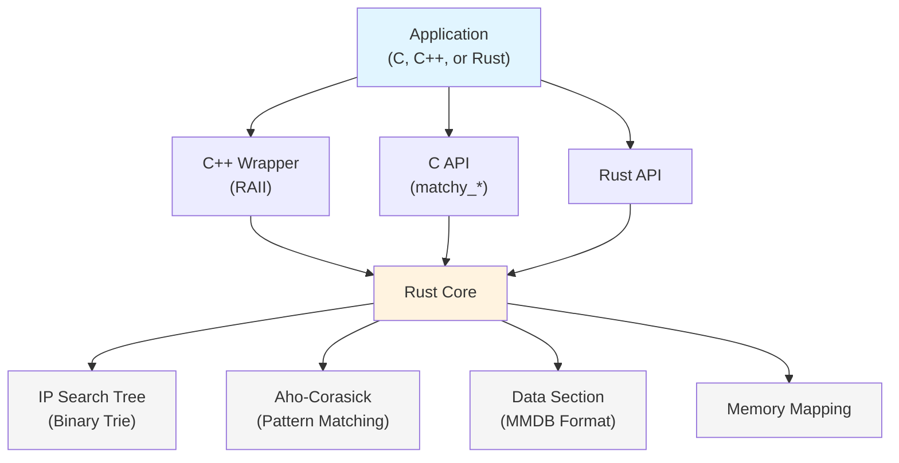

# Matchy

[](https://github.com/sethhall/matchy/actions/workflows/ci.yml)
[](LICENSE)
[](https://www.rust-lang.org/)

**Fast database for IP address and pattern matching with rich data storage.**

Match IP addresses, CIDR ranges, and thousands of glob patterns in microseconds. Perfect for threat intelligence, GeoIP, domain categorization, and network security applications.

## Why Matchy?

Traditional IP/domain lookups fall apart at scale:
- 🐌 Sequential pattern matching: 10,000 patterns = 10,000× slower
- 🔒 Hash tables only do exact matches—no wildcards for domains like `*.malicious.com`
- 💾 Loading databases takes hundreds of milliseconds
- 📈 Running 50 worker processes means loading the same data 50 times

**Matchy solves these problems with a unified database that supports both IP addresses and patterns.**

### Real-World Use Cases

**🛡️ Threat Intelligence**

Query malicious IPs (`1.2.3.4`), suspicious domains (`*.phishing-site.com`), and URL patterns (`http://*/admin/config.php`) from a single database. Check every user interaction against 50,000+ threat indicators in ~20 microseconds.

```rust
// Check both IPs and domains with one database
db.lookup("1.2.3.4")?;           // IP lookup
db.lookup("evil.malicious.com")?; // Pattern match
```

**🌍 GeoIP with Custom Data**

Drop-in replacement for MaxMind GeoIP databases with custom metadata support. Query IP addresses and get rich JSON-like structured data:

```rust
match db.lookup("8.8.8.8")? {
    Some(QueryResult::Ip { data, prefix_len }) => {
        // data contains country, city, coordinates, etc.
        println!("Location: {:?} (/{prefix_len})", data);
    }
}
```

**📊 Multi-Process Memory Efficiency**

Run 64 worker processes with the same 100MB database? Matchy uses memory mapping so the OS automatically shares pages. **99% memory savings**: 64 processes = 100MB RAM, not 6.4GB.

**🔥 Instant Loading**

Memory-mapped databases load in <100 microseconds regardless of size. No deserialization overhead—direct access to on-disk structures.

## Key Features

### Unified Database
- **IP addresses & CIDR ranges**: Binary search tree for O(log n) lookups
- **Glob patterns**: Aho-Corasick automaton for O(n) matching
- **Auto-detection**: One query function handles both types
- **Rich data**: Store JSON-like structured data with each entry

### Performance
- **1M+ queries/second** even with 50,000 patterns
- **<100μs loading time** via memory mapping
- **Zero-copy**: Direct access to on-disk structures
- **Memory sharing**: Automatic OS-level page sharing across processes

### Compatibility
- **libmaxminddb compatible** (planned): Drop-in replacement for existing GeoIP code
- **C/C++/Rust APIs**: Stable FFI for any language
- **MMDB format**: Compatible with MaxMind database tools

## Quick Start

### Rust API

```rust
use matchy::{Database, DatabaseBuilder, MatchMode, DataValue, QueryResult};
use std::collections::HashMap;

// Build a database with both IP and pattern entries
let mut builder = DatabaseBuilder::new(MatchMode::CaseSensitive);

// Add IP address with data
let mut ip_data = HashMap::new();
ip_data.insert("country".to_string(), DataValue::String("US".to_string()));
ip_data.insert("threat_level".to_string(), DataValue::String("low".to_string()));
builder.add_entry("8.8.8.8", ip_data)?;

// Add CIDR range
let mut cidr_data = HashMap::new();
cidr_data.insert("type".to_string(), DataValue::String("internal".to_string()));
builder.add_entry("10.0.0.0/8", cidr_data)?;

// Add pattern with data
let mut pattern_data = HashMap::new();
pattern_data.insert("category".to_string(), DataValue::String("malware".to_string()));
pattern_data.insert("threat_level".to_string(), DataValue::String("high".to_string()));
builder.add_entry("*.evil.com", pattern_data)?;

// Build and save
let database_bytes = builder.build()?;
std::fs::write("threats.db", &database_bytes)?;

// Query the database (auto-detects IP vs pattern)
let db = Database::open("threats.db")?;

// IP lookup
match db.lookup("8.8.8.8")? {
    Some(QueryResult::Ip { data, prefix_len }) => {
        println!("IP found: {:?} (/{prefix_len})", data);
    }
    Some(QueryResult::NotFound) => println!("Not found"),
    None => println!("No IP data in database"),
}

// Pattern matching
match db.lookup("malware.evil.com")? {
    Some(QueryResult::Pattern { pattern_ids, data }) => {
        println!("Matched {} patterns", pattern_ids.len());
        for (i, d) in data.iter().enumerate() {
            if let Some(threat_data) = d {
                println!("  Pattern {}: {:?}", pattern_ids[i], threat_data);
            }
        }
    }
    Some(QueryResult::NotFound) => println!("No match"),
    None => println!("No pattern data in database"),
}
```

### C API

```c
#include "matchy.h"
#include <stdio.h>

int main() {
    // Build database
    matchy_builder_t *builder = matchy_builder_new();
    matchy_builder_add(builder, "1.2.3.4", "{\"threat\": \"high\"}");
    matchy_builder_add(builder, "*.evil.com", "{\"category\": \"malware\"}");
    matchy_builder_save(builder, "threats.db");
    matchy_builder_free(builder);
    
    // Query database
    matchy_t *db = matchy_open("threats.db");
    if (!db) {
        fprintf(stderr, "Failed to open database\n");
        return 1;
    }
    
    // Unified query - automatically detects IP vs pattern
    matchy_result_t result = matchy_query(db, "1.2.3.4");
    if (result.found && result.data_json) {
        printf("Found: %s\n", result.data_json);
        if (result.prefix_len > 0) {
            printf("CIDR prefix: /%d\n", result.prefix_len);
        }
        matchy_free_result(&result);
    }
    
    // Query pattern
    result = matchy_query(db, "malware.evil.com");
    if (result.found && result.data_json) {
        printf("Pattern match: %s\n", result.data_json);
        matchy_free_result(&result);
    }
    
    matchy_close(db);
    return 0;
}
```

## Building Databases

Matchy provides a command-line tool to build databases from various input formats. The tool automatically detects whether entries are IP addresses, CIDR ranges, or glob patterns.

### Installation

```bash
cargo install --path .
# Or run directly:
cargo build --release
./target/release/matchy --help
```

### Input Formats

#### Text Format (Simple - No Metadata)

One entry per line. Supports IP addresses, CIDR ranges, and glob patterns. Lines starting with `#` are comments. Perfect for simple blocklists or allowlists.

**Example: `entries.txt`**
```text
# IP addresses
8.8.8.8
1.1.1.1

# CIDR ranges
10.0.0.0/8
192.168.0.0/16

# Glob patterns
*.malicious.com
*.phishing-site.com
http://*/admin/config.php
```

**Build command:**
```bash
matchy build entries.txt -o database.mmdb
```

#### CSV Format (With Metadata)

CSV file with headers. The first column must be named `entry` (or `key`) and contains the IP/CIDR/pattern. All other columns become metadata fields. Values are automatically typed as numbers, booleans, or strings.

**Example: `threats.csv`**
```csv
entry,threat_level,category,first_seen,blocked
1.2.3.4,high,malware,2025-01-01,true
10.0.0.0/8,low,internal,2024-12-15,false
*.evil.com,critical,phishing,2025-01-10,true
malware.example.com,high,malware,2025-01-05,true
http://*/admin/config.php,medium,scanning,2024-11-20,false
```

**Build command:**
```bash
matchy build threats.csv -o threats.mmdb --format csv
```

**Example: `geoip.csv`**
```csv
entry,country,city,latitude,longitude
8.8.8.0/24,US,Mountain View,37.386,-122.084
1.1.1.0/24,AU,Sydney,-33.868,151.209
185.199.108.0/22,US,San Francisco,37.774,-122.419
```

```bash
matchy build geoip.csv -o geoip.mmdb --format csv \
  --database-type "GeoIP-Lite" \
  --description "Custom GeoIP database"
```

#### JSON Format (With Complex Metadata)

JSON array with entries containing a `key` (IP/CIDR/pattern) and optional `data` (arbitrary JSON object). Use this for nested data structures or arrays.

**Example: `threats.json`**
```json
[
  {
    "key": "1.2.3.4",
    "data": {
      "threat_level": "high",
      "category": "malware",
      "first_seen": "2025-01-01",
      "tags": ["botnet", "ddos"],
      "attribution": {
        "actor": "APT28",
        "confidence": 0.85
      }
    }
  },
  {
    "key": "10.0.0.0/8",
    "data": {
      "type": "internal",
      "description": "Private network range"
    }
  },
  {
    "key": "*.evil.com",
    "data": {
      "threat_level": "critical",
      "category": "phishing",
      "blocked": true
    }
  }
]
```

**Build command:**
```bash
matchy build threats.json -o threats.mmdb --format json
```

#### MISP Format (Threat Intelligence)

MISP (Malware Information Sharing Platform) JSON format for threat intelligence feeds. The tool automatically extracts IP addresses, domains, and URLs with their associated threat data.

**Build command:**
```bash
matchy build misp-export.json -o threats.mmdb --format misp
```

### Build Options

```bash
matchy build [OPTIONS] <INPUT>... -o <OUTPUT>

Options:
  -o, --output <FILE>          Output database file (.mmdb extension recommended)
  -f, --format <FORMAT>        Input format: text, csv, json, or misp [default: text]
  -t, --database-type <TYPE>   Database type name (e.g., "MyCompany-ThreatIntel")
  -d, --description <TEXT>     Description text
      --desc-lang <LANG>       Language code for description [default: en]
  -v, --verbose                Verbose output during build
```

### Multiple Input Files

You can specify multiple input files to combine entries:

```bash
# Combine multiple text files
matchy build ips.txt domains.txt urls.txt -o combined.mmdb

# Combine multiple CSV files
matchy build threats1.csv threats2.csv threats3.csv -o threats.mmdb --format csv

# Combine multiple JSON files
matchy build threat1.json threat2.json threat3.json -o threats.mmdb --format json
```

### Examples

**Simple blocklist (no metadata):**
```bash
# Just match IPs and domains, no data attached
matchy build blocklist.txt -o blocklist.mmdb
```

**Threat intelligence database with metadata:**
```bash
matchy build threats.csv -o threats.mmdb --format csv \
  --database-type "ThreatIntel" \
  --description "Combined IP and domain threat indicators" \
  --verbose
```

**GeoIP-style database:**
```bash
matchy build geoip.csv -o geoip.mmdb --format csv \
  --database-type "GeoIP-Lite" \
  --description "Custom GeoIP database"
```

**Build from MISP export:**
```bash
matchy build misp-export.json -o misp-threats.mmdb --format misp --verbose
```

### Querying Databases

Once built, query your database using the CLI:

```bash
# Query an IP address
matchy query threats.mmdb 1.2.3.4
# Output: [{"threat_level":"high","category":"malware","first_seen":"2025-01-01","blocked":true}]

# Query a domain (pattern matching)
matchy query threats.mmdb evil.malicious.com
# Output: [{"threat_level":"critical","category":"phishing","blocked":true}]

# Query with no match returns empty array
matchy query threats.mmdb benign.example.com
# Output: []

# Quiet mode (exit code only: 0=found, 1=not found)
matchy query threats.mmdb 1.2.3.4 --quiet
echo $?  # 0 if found, 1 if not found
```

### Inspecting Databases

View database information and statistics:

```bash
# Human-readable output
matchy inspect threats.mmdb

# JSON output
matchy inspect threats.mmdb --json

# Verbose output with full metadata
matchy inspect threats.mmdb --verbose
```

**Example output:**
```
Database: threats.mmdb
Format:   Combined IP+String database

Capabilities:
  IP lookups:      ✓
    Entries:       1,234
  String lookups:  ✓
    Literals:      ✓ (567 strings)
    Globs:         ✓ (890 patterns)

Metadata:
  Database type:   ThreatIntel
  Description:
    en: Combined IP and domain threat indicators
  Build time:      2025-01-15 10:30:45 UTC (1736936445)
```

## Performance

Measured on M4 MacBook Air:

| Workload | Throughput | Notes |
|----------|------------|-------|
| IP lookups | 1.5M queries/sec | Binary tree search |
| Pattern matching (10K patterns) | 1.4M queries/sec | Aho-Corasick |
| Pattern matching (50K patterns) | 1M queries/sec | Extreme scale |
| Database load time | <150μs | Memory-mapped |
| Build time (1K entries) | ~4ms | One-time cost |

See [DEVELOPMENT.md](./DEVELOPMENT.md) for detailed benchmarks.

## Architecture



**Hybrid approach**: IP addresses use a binary search tree for O(log n) lookups. Patterns use Aho-Corasick for O(n) simultaneous matching. Both share the same data section with automatic deduplication.

## Building

**Requirements:**
- Rust 1.70+ (stable toolchain)
- C compiler (for C API consumers)
- cbindgen (installed automatically as build dependency)

```bash
# Build optimized library
cargo build --release

# Run test suite
cargo test

# Run benchmarks
cargo bench

# Generate API documentation
cargo doc --no-deps --open
```

The build process automatically generates `include/matchy.h` for C/C++ integration.

**Build artifacts:**
- `target/release/libmatchy.dylib` (macOS)
- `target/release/libmatchy.so` (Linux)
- `target/release/libmatchy.a` (static library)
- `include/matchy.h` (C header, auto-generated)

## API Reference

### C API Functions

**Builder API:**
- `matchy_builder_t* matchy_builder_new()` - Create database builder
- `int matchy_builder_add(builder, key, json_data)` - Add IP/CIDR/pattern with JSON data
- `int matchy_builder_set_description(builder, desc)` - Set metadata
- `int matchy_builder_save(builder, filename)` - Build and save to file
- `int matchy_builder_build(builder, &buffer, &size)` - Build to memory
- `void matchy_builder_free(builder)` - Free builder

**Query API:**
- `matchy_t* matchy_open(filename)` - Open database (memory-mapped)
- `matchy_t* matchy_open_buffer(buffer, size)` - Open from memory buffer
- `void matchy_close(db)` - Close database
- `matchy_result_t matchy_query(db, query)` - **Unified query** (auto-detects IP vs pattern)
- `void matchy_free_result(&result)` - Free query result
- `const char* matchy_version()` - Get library version

**Error Codes:**
- `MATCHY_SUCCESS` (0) - Success
- `MATCHY_ERROR_FILE_NOT_FOUND` (-1) - File not found
- `MATCHY_ERROR_INVALID_FORMAT` (-2) - Invalid database format
- `MATCHY_ERROR_INVALID_PARAM` (-5) - Invalid parameter
- `MATCHY_ERROR_IO` (-6) - I/O error

### Rust API

**Core Types:**
- `Database` - Unified database for queries
- `DatabaseBuilder` - Build databases (alias for `MmdbBuilder`)
- `QueryResult` - Result enum (IP/Pattern/NotFound)
- `DataValue` - Rich data type (String/Int/Map/Array/etc.)

See [API documentation](https://docs.rs/matchy) for complete reference.

## Linking

```bash
# C programs
gcc -o app app.c -L./target/release -lmatchy -lpthread -ldl -lm

# C++ programs
g++ -o app app.cpp -L./target/release -lmatchy -lpthread -ldl -lm

# Add to rpath (macOS)
install_name_tool -add_rpath @executable_path/. app

# Add to rpath (Linux)
export LD_LIBRARY_PATH=./target/release:$LD_LIBRARY_PATH
```

## Database Format

Matchy uses a hybrid binary format:

```
┌──────────────────────────────────────┐
│  IP Search Tree (binary trie)        │  ← Fast IP lookups
├──────────────────────────────────────┤
│  Data Section (MMDB-compatible)      │  ← Shared rich data
├──────────────────────────────────────┤
│  Pattern Matcher (Aho-Corasick)      │  ← Fast pattern matching
├──────────────────────────────────────┤
│  Metadata                            │  ← Database info
└──────────────────────────────────────┘
```

All structures use file offsets (not pointers) for:
- Direct memory mapping without deserialization
- Cross-process page sharing via shared memory
- Safety validation before dereferencing

## Pattern Syntax

Supported glob patterns:
- `*` - Match zero or more characters
- `?` - Match exactly one character  
- `[abc]` - Match any character in set
- `[a-z]` - Match any character in range
- `[!abc]` - Match any character not in set

Examples:
- `*.evil.com` - Matches `www.evil.com`, `malware.evil.com`
- `test_*.log` - Matches `test_001.log`, `test_debug.log`
- `http://*/admin/*` - Matches any URL with `/admin/` path

## Documentation

- [API_REDESIGN.md](./API_REDESIGN.md) - Complete API specification
- [DEVELOPMENT.md](./DEVELOPMENT.md) - Architecture and implementation details
- [examples/](./examples/) - Example programs
- API docs: `cargo doc --no-deps --open`

## Testing

```bash
cargo test              # Run test suite
cargo test -- --nocapture  # With output
cargo bench             # Run benchmarks
```

## Contributing

Contributions welcome! Please:
- Run `cargo fmt` and `cargo clippy` before submitting
- Ensure all tests pass with `cargo test`
- Add tests for new features
- Update documentation

## Roadmap

- [ ] libmaxminddb compatibility layer (drop-in replacement)
- [ ] C++ RAII wrapper for modern C++
- [ ] Python bindings
- [ ] Streaming database updates (append-only)
- [ ] Compression support

## License

BSD-2-Clause

## Acknowledgments

Built on the Paraglob pattern matching algorithm with extensions for IP address lookups and rich data storage.
