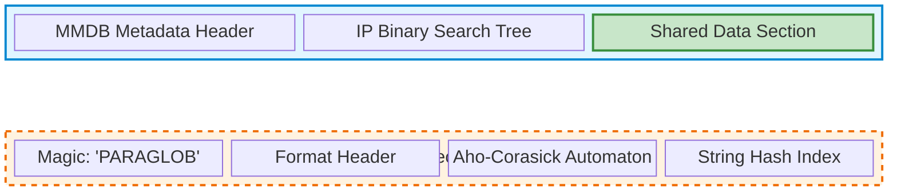

# Binary Format

Detailed binary format specification for Matchy databases.

## File Structure

A `.mxy` file consists of two main sections: the required MMDB section and an optional PARAGLOB extension:



The PARAGLOB section is only present when the database includes string literals or glob patterns. IP-only databases contain just the MMDB section.

## MMDB Section

Standard MaxMind DB format:
- See [MaxMind DB Spec](https://maxmind.github.io/MaxMind-DB/)

## PARAGLOB Section

### Header

```rust
#[repr(C)]
struct ParaglobHeader {
    magic: [u8; 8],      // "PARAGLOB"
    version: u32,        // Format version
    num_nodes: u32,      // AC automaton nodes
    nodes_offset: u32,   // Offset to nodes
    num_literals: u32,   // Literal count
    literals_offset: u32,// Offset to literals
}
```

### AC Node

```rust
#[repr(C)]
struct AcNode {
    failure_offset: u32, // Failure link
    edges_offset: u32,   // Edge array
    num_edges: u16,      // Edge count
    output_offset: u32,  // Match data
}
```

### Literal Entry

```rust
#[repr(C)]
struct LiteralEntry {
    hash: u64,           // String hash
    string_offset: u32,  // String data
    data_offset: u32,    // Associated data
}
```

## Endianness

All multi-byte integers use **big-endian** (network byte order).

## Alignment

All structures are naturally aligned:
- `u8`: 1-byte alignment
- `u16`: 2-byte alignment
- `u32`: 4-byte alignment
- `u64`: 8-byte alignment

## See Also

- [MMDB Integration](../mmdb-integration-design.md) - How the format maintains compatibility
- [System Architecture](overview.md) - Overall system design
- [Performance Results](performance-results.md) - Format performance characteristics
