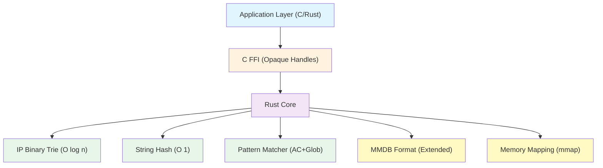
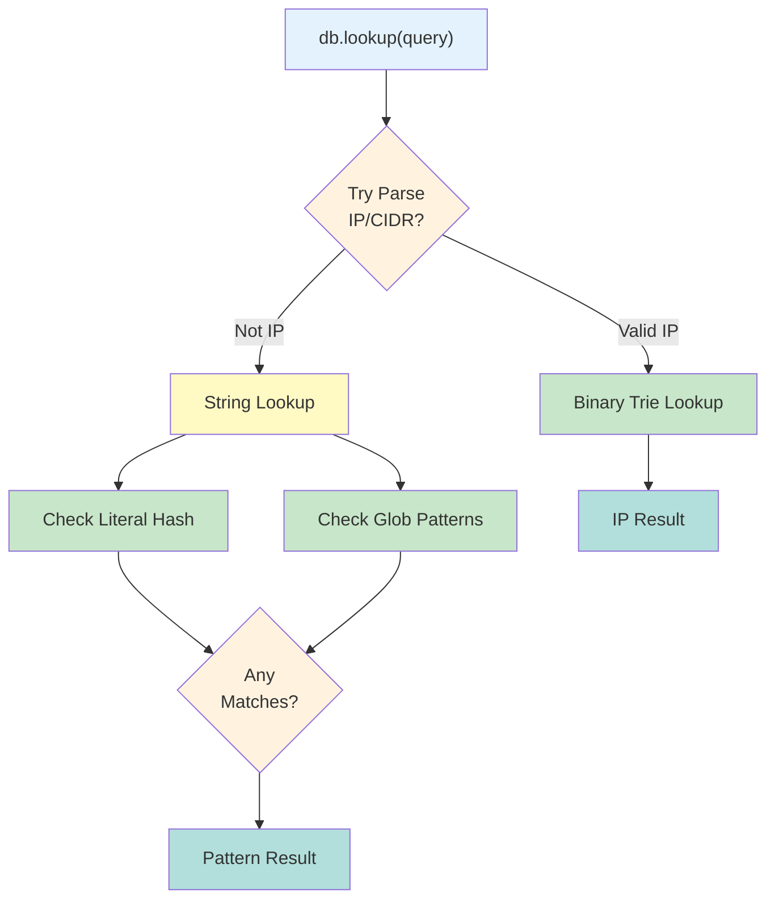
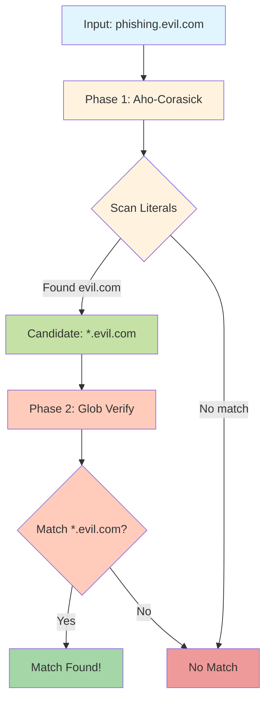
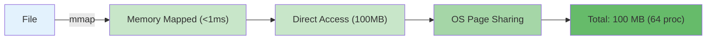
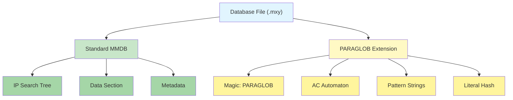
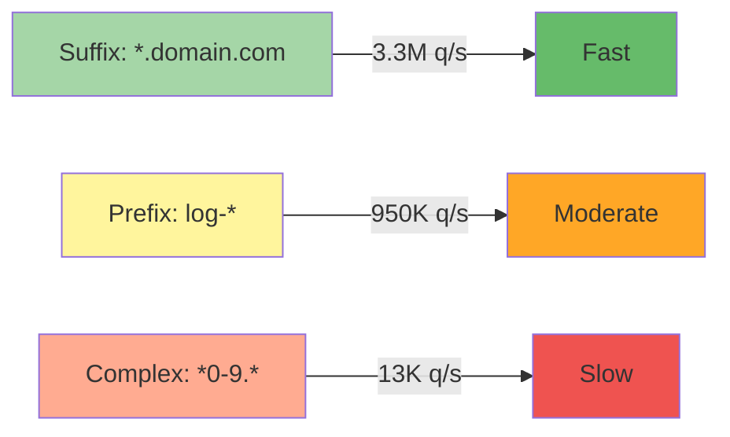

# System Architecture

Matchy is built on three core principles: **unified querying**, **zero-copy memory mapping**, and **memory safety**.

## High-Level Architecture



## Query Routing

One API automatically detects and routes queries:



## Pattern Matching Pipeline

Two-phase approach for glob patterns:



## Memory Architecture

### Traditional Approach


### Matchy Approach



**Memory Sharing**: OS automatically shares physical pages across processes reading the same file.

## Extended MMDB Format



**Backwards Compatible:**
- IP-only databases work with MaxMind tools (ignore PARAGLOB section)
- Standard `.mmdb` files work with Matchy
- Extensions gracefully skipped by old readers

## Zero-Copy Design

All data structures use **file offsets** instead of memory pointers. This is the key to enabling memory mapping:

**Traditional approach (pointers):**
```rust
struct Node {
    next: *const Node,  // Memory address - invalid across processes!
}
```

**Matchy approach (offsets):**
```rust
struct Node {
    next_offset: u32,   // File offset - works anywhere!
}
```

When you open a memory-mapped file, it might be loaded at address `0x1000` in one process and `0x5000` in another. Pointers break, but offsets always work because they're relative to the file start.

This applies to all structures:
- **AC automaton nodes** reference edges by offset
- **Pattern entries** reference strings by offset  
- **Tree nodes** reference children by offset

Every offset is validated before dereferencing to prevent undefined behavior.

## Performance at a Glance

| Operation | Time | Technology |
|-----------|------|------------|
| **Load 100K IPs** | <1ms | `mmap()` syscall |
| **IP Lookup** | 0.25µs | Binary trie O(log n) |
| **Exact String** | 0.88µs | Hash table O(1) |
| **Suffix Pattern** | 0.30µs | AC + simple glob |
| **Complex Pattern** | 2-80µs | AC + backtracking |

*M4 MacBook Air benchmarks*

## Safety Guarantees

### Memory Safety

**Core matching algorithms**: Written in safe Rust
- Aho-Corasick traversal
- Glob pattern matching  
- Binary tree walking
- Hash table lookups

**Limited unsafe code** is used only for:
1. **C FFI boundaries** - Converting between C and Rust types
2. **Memory mapping** - `mmap()` system call requires unsafe
3. **Binary format access** - Reading offset-based structures from raw bytes

All unsafe operations are validated:
- Null pointer checks before dereferencing
- Offset bounds checking before structure access
- Alignment validation for structured reads
- Lifetime tracking to prevent use-after-free

### FFI Safety

The C API follows strict safety rules:

**1. Null checks on every pointer:**
```rust
if db.is_null() || query.is_null() {
    return MATCHY_ERROR_INVALID_PARAM;
}
```

**2. Panic catching at boundaries:**
```rust
let result = std::panic::catch_unwind(|| {
    // ... actual work ...
});
result.unwrap_or(MATCHY_ERROR_UNKNOWN)
```

**3. Opaque handles for ownership:**
```rust
// No raw struct access from C
pub struct matchy_t { _private: [u8; 0] }
```

Panics never cross FFI boundaries - they're caught and converted to error codes.

## Design Trade-offs

### Immutability

✅ **Benefits:**
- No locks needed for concurrent reads
- Enables memory mapping
- Guaranteed consistency

📝 **To Update (Live Reload):**

Databases are read-only, but you can update them **while processes are running**:

1. Build new database with updated entries
2. Atomically replace the file (e.g., `mv new.mxy old.mxy`)
3. Close old database handle
4. Reopen database (<1ms load time)
5. Continue serving requests

**Why this works:**
- Opening a database takes <1ms (just mmap)
- Old processes keep using the old file until they reopen
- No downtime needed - reload between requests
- OS handles the file transition cleanly

This is why we obsessed over making database opening so fast - you can reload threat feeds every few minutes in production without anyone noticing.

### Pattern Complexity



**Recommendation:** Use suffix patterns when possible for best performance.

## Next Steps

- [Binary Format Details](./binary-format.md) - Deep dive into file format
- [Performance Analysis](./performance.md) - Benchmarks and optimization
- [MMDB Integration](../mmdb-integration-design.md) - MaxMind compatibility
