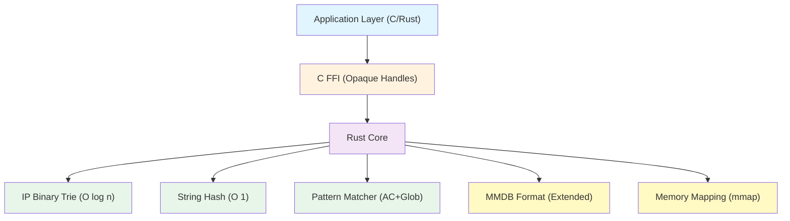
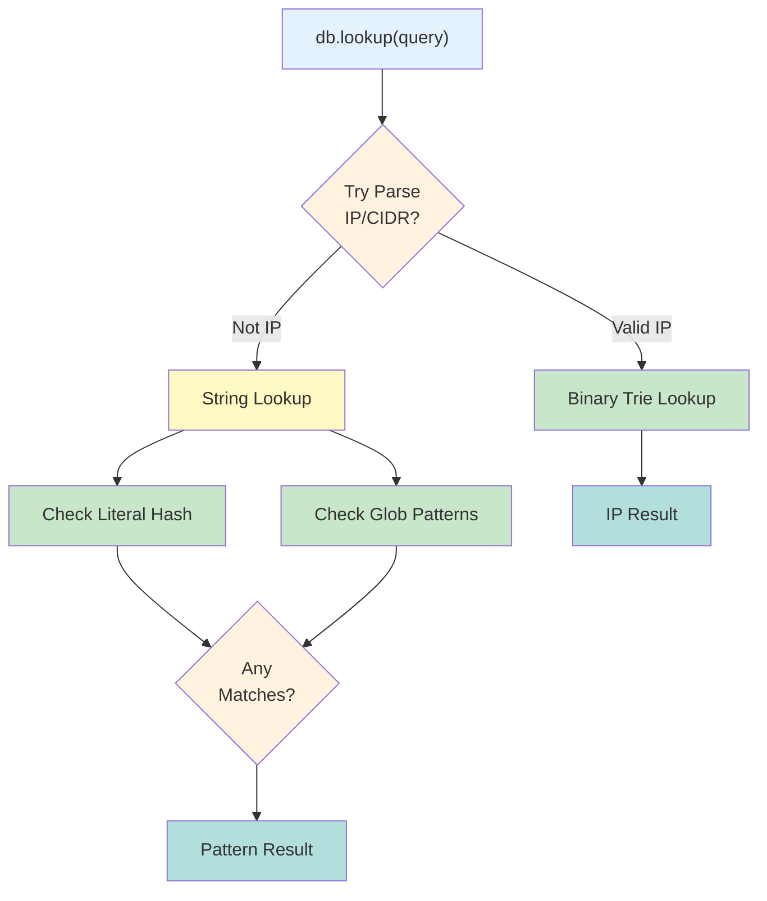
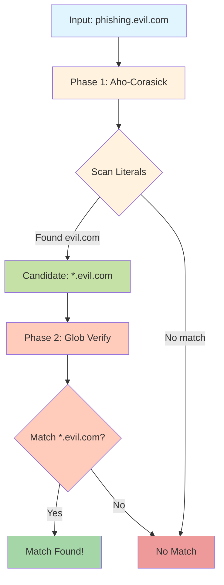
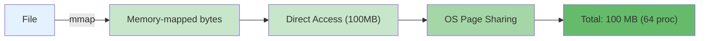
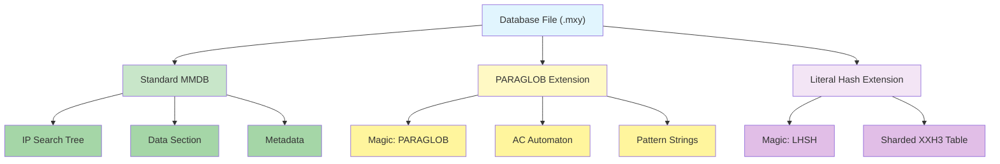
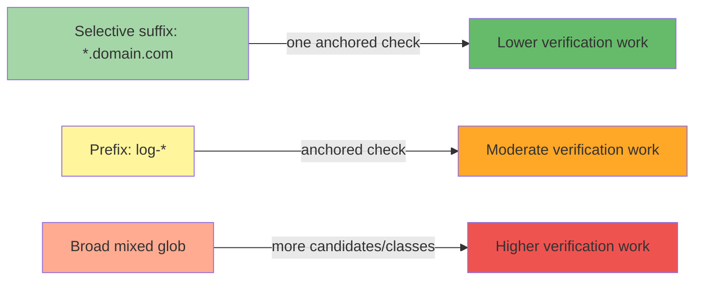

# System Architecture

Matchy is built on three core principles: **unified querying**, **direct memory-mapped index access**, and **memory safety**.

## High-Level Architecture


```mermaid
graph TD
    A["Application Layer (C/Rust)"] --> B["C FFI (Opaque Handles)"]
    B --> C[Rust Core]
    
    C --> D["IP Binary Trie (O log n)"]
    C --> E["String Hash (O 1)"]
    C --> F["Pattern Matcher (AC+Glob)"]
    C --> G["MMDB Format (Extended)"]
    C --> H["Memory Mapping (mmap)"]
    
    style A fill:#e1f5fe
    style B fill:#fff3e0
    style C fill:#f3e5f5
    style D fill:#e8f5e9
    style E fill:#e8f5e9
    style F fill:#e8f5e9
    style G fill:#fff9c4
    style H fill:#fff9c4
```

## Query Routing

One API automatically detects and routes queries:


```mermaid
flowchart TD
    A["db.lookup(query)"] --> B{"Try Parse
IP/CIDR?"}
    B -->|"Valid IP"| F["Binary Trie Lookup"]
    B -->|"Not IP"| C["String Lookup"]
    
    C --> G["Check Literal Hash"]
    C --> H["Check Glob Patterns"]
    
    G --> J{"Any
Matches?"}
    H --> J
    
    F --> K["IP Result"]
    J --> L["Pattern Result"]
    
    style A fill:#e3f2fd
    style B fill:#fff3e0
    style C fill:#fff9c4
    style F fill:#c8e6c9
    style G fill:#c8e6c9
    style H fill:#c8e6c9
    style J fill:#fff3e0
    style K fill:#b2dfdb
    style L fill:#b2dfdb
```

## Pattern Matching Pipeline

Two-phase approach for glob patterns:


```mermaid
flowchart TD
    A["Input: phishing.evil.com"] --> B["Phase 1: Aho-Corasick"]
    
    B --> C{"Scan Literals"}
    C -->|"Found evil.com"| D["Candidate: *.evil.com"]
    C -->|"No match"| E["No Match"]
    
    D --> F["Phase 2: Glob Verify"]
    F --> G{"Match *.evil.com?"}
    G -->|"Yes"| H["Match Found!"]
    G -->|"No"| E
    
    style A fill:#e1f5fe
    style B fill:#fff3e0
    style C fill:#fff3e0
    style D fill:#c5e1a5
    style F fill:#ffccbc
    style G fill:#ffccbc
    style H fill:#a5d6a7
    style E fill:#ef9a9a
```

## Memory Architecture

### Traditional Approach


```mermaid
graph LR
    A[File] -->|Read| B[Deserialize]
    B -->|200ms| C["Heap: 6GB × 64 proc"]
    C --> D["Total: 6,400 MB"]
    
    style A fill:#e3f2fd
    style B fill:#fff3e0
    style C fill:#ffcdd2
    style D fill:#ef5350
```

### Matchy Approach


```mermaid
graph LR
    A[File] -->|mmap| B["Memory-mapped bytes"]
    B --> C["Direct Access (100MB)"]
    C --> D["OS Page Sharing"]
    D --> E["Total: 100 MB (64 proc)"]
    
    style A fill:#e3f2fd
    style B fill:#c8e6c9
    style C fill:#c8e6c9
    style D fill:#a5d6a7
    style E fill:#66bb6a
```

**Memory Sharing**: OS automatically shares physical pages across processes reading the same file.

## Extended MMDB Format


```mermaid
graph TD
    A["Database File (.mxy)"] --> B["Standard MMDB"]
    A --> C["PARAGLOB Extension"]
    A --> D["Literal Hash Extension"]
    
    B --> B1["IP Search Tree"]
    B --> B2["Data Section"]
    B --> B3[Metadata]
    
    C --> C1["Magic: PARAGLOB"]
    C --> C2["AC Automaton"]
    C --> C3["Pattern Strings"]
    D --> D1["Magic: LHSH"]
    D --> D2["Sharded XXH3 Table"]
    
    style A fill:#e1f5fe
    style B fill:#c8e6c9
    style C fill:#fff9c4
    style B1 fill:#a5d6a7
    style B2 fill:#a5d6a7
    style B3 fill:#a5d6a7
    style C1 fill:#fff59d
    style C2 fill:#fff59d
    style C3 fill:#fff59d
    style D fill:#f3e5f5
    style D1 fill:#e1bee7
    style D2 fill:#e1bee7
```

**Backwards Compatible:**
- IP-only databases work with MaxMind tools (ignore PARAGLOB section)
- Standard `.mmdb` files work with Matchy
- Extensions gracefully skipped by old readers

## Zero-Copy Design

Serialized structures use **integer offsets** instead of memory pointers. Each
field documents its own base; this is the key to enabling memory mapping:

**Traditional approach (pointers):**
```rust
struct Node {
    next: *const Node,  // Memory address - invalid across processes!
}
```

**Matchy approach (offsets):**
```rust
struct Node {
    next_offset: u32,   // Offset from this field's documented section base
}
```

When you open a memory-mapped file, it might be loaded at address `0x1000` in one process and `0x5000` in another. Pointers break, but offsets remain stable because each is interpreted relative to its documented base (such as the file, MMDB data section, PARAGLOB buffer, or AC buffer).

This applies to all structures:
- **AC automaton nodes** reference edges by offset
- **Pattern entries** reference strings by offset  
- **MMDB tree records** encode child node numbers or data-section references

Every offset is validated before dereferencing to prevent undefined behavior.

## Performance at a Glance

- **Opening** maps the file and validates bounded structure; storage, page-cache state, extensions, and legacy scanning affect latency.
- **IP lookup** is bounded by 32 IPv4 or 128 IPv6 tree steps, followed by selected-value decoding.
- **Exact-string lookup** uses average-case O(1) sharded hash probing.
- **Glob matching** uses Aho-Corasick candidate discovery plus verification whose cost depends on pattern shape and input.

See [Performance Benchmarks](../reference/benchmarks.md) for a reproducible
measurement checklist. Historical figures are not current guarantees.

## Safety Guarantees

### Memory Safety

**Core matching algorithms**: Written in safe Rust
- Aho-Corasick traversal
- Glob pattern matching  
- Binary tree walking
- Hash table lookups

**Limited unsafe code** is used only for:
1. **C FFI boundaries** - Converting between C and Rust types
2. **Memory mapping** - `mmap()` system call requires unsafe
3. **Binary format access** - Reading offset-based structures from raw bytes

Unsafe boundaries are kept small and guarded by checks appropriate to each operation:
- Null pointer checks before dereferencing
- Offset bounds checking before structure access
- Alignment validation for structured reads
- Lifetime tracking to prevent use-after-free

### FFI Safety

The C API follows strict safety rules:

**1. Null checks on every pointer:**
```rust
if db.is_null() || query.is_null() {
    return empty_matchy_result();
}
```

**2. Panic catching at boundaries:**
```rust
let result = std::panic::catch_unwind(|| {
    // ... actual work ...
});
result.unwrap_or_else(|_| empty_matchy_result())
```

**3. Opaque handles for ownership:**
```rust
// No raw struct access from C
pub struct matchy_t { _private: [u8; 0] }
```

Panics never cross FFI boundaries - they're caught and converted to documented error codes or sentinel return values.

## Design Trade-offs

### Immutability

✅ **Benefits:**
- No locks needed for concurrent reads
- Enables memory mapping
- Guaranteed consistency

📝 **To Update (Live Reload):**

Databases are read-only, but you can update them **while processes are running**:

1. Build new database with updated entries
2. Atomically replace the file (e.g., `mv new.mxy old.mxy`)
3. Close old database handle
4. Reopen the memory-mapped database
5. Continue serving requests

**Why this works:**
- Opening avoids whole-file deserialization and performs bounded structural parsing
- Old processes keep using the old file until they reopen
- No downtime needed - reload between requests
- OS handles the file transition cleanly

This design avoids rebuilding indexes during reload. Measure reload latency and
temporary memory under the production update cadence.

### Pattern Complexity


```mermaid
graph LR
    A["Selective suffix: *.domain.com"] -->|"one anchored check"| B[Lower verification work]
    C["Prefix: log-*"] -->|"anchored check"| D[Moderate verification work]
    E["Broad mixed glob"] -->|"more candidates/classes"| F[Higher verification work]
    
    style A fill:#a5d6a7
    style B fill:#66bb6a
    style C fill:#fff59d
    style D fill:#ffa726
    style E fill:#ffab91
    style F fill:#ef5350
```

**Recommendation:** Use suffix patterns when possible for best performance.

## Next Steps

- [Binary Format Details](../reference/binary-format.md) - Deep dive into file format
- [Performance Analysis](./performance.md) - Benchmarks and optimization
- [MMDB Integration](../reference/mmdb-integration.md) - MaxMind compatibility
