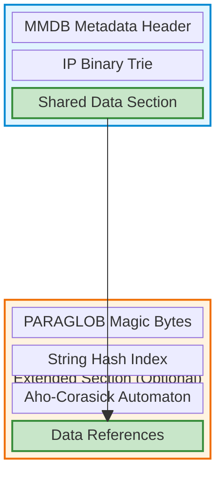
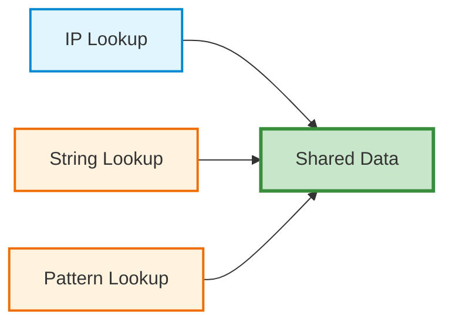
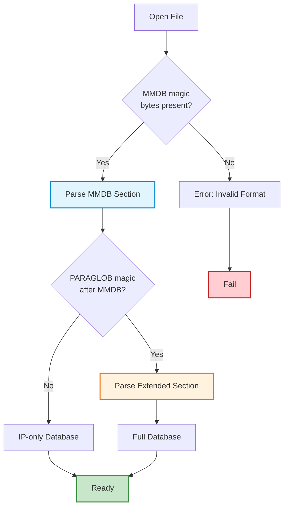

# Matchy Database Format (.mxy)

One of Matchy's key innovations is its hybrid database format that extends the proven MaxMind DB (MMDB) format while maintaining full backward compatibility. This means you can use Matchy as a drop-in replacement for libmaxminddb, but you also get the ability to query string literals and glob patterns in the same database—without sacrificing performance or compatibility.

If you're familiar with MMDB files (like GeoIP databases), you already know how to use Matchy. If you need more than just IP lookups, Matchy seamlessly extends the format without breaking existing tools. It's the best of both worlds: compatibility with the MMDB ecosystem and powerful new query capabilities.

The Matchy database format (`.mxy`) achieves this by extending the standard MMDB format to support IP addresses, string literals, and glob patterns in a single unified, memory-mappable database file.

## Design Goals

1. **Backward compatibility** - Read standard MMDB files without modification
2. **Forward compatibility** - IP-only `.mxy` files work with existing MMDB tools
3. **Seamless extension** - Add string/pattern support without breaking compatibility
4. **Performance** - Zero overhead for standard MMDB IP lookups
5. **Single file** - All query types in one memory-mappable database

## File Structure

The `.mxy` format uses a dual-section approach with optional extensions:



### MMDB Section (Always Present)

The base section follows the standard MaxMind DB format:

- **MMDB Metadata Header**: Database configuration, record size, node count
- **IP Binary Trie**: Prefix tree for fast IP address lookups
- **Shared Data Section**: Encoded data values referenced by all query types

### Extended Section (Optional)

When string or pattern matching is needed, an additional section is appended:

- **PARAGLOB Magic Bytes**: 8-byte identifier marking the extended section
- **String Hash Index**: Hash table for exact string literal matching
- **Aho-Corasick Automaton**: Multi-pattern matching for glob expressions
- **Data References**: Offsets pointing back into the shared data section

## Key Innovation: Shared Data Section

The critical design element is that **both sections reference the same data section**:



This means:
- ✅ No data duplication regardless of query type
- ✅ Memory-efficient for databases with mixed query types
- ✅ Single source of truth for all metadata
- ✅ Consistent results across query methods

## Compatibility Matrix

| Database Type | Matchy | libmaxminddb | Notes |
|---------------|--------|--------------|-------|
| Standard MMDB (`.mmdb`) | ✅ Full | ✅ Full | Complete compatibility |
| IP-only `.mxy` | ✅ Full | ✅ IP lookups | Extended section absent |
| Full `.mxy` with strings/patterns | ✅ Full | ✅ IP lookups only | Extended section ignored by libmaxminddb |

### Reading Standard MMDB Files

Matchy is a drop-in replacement for libmaxminddb:
```rust
// Works with any standard MMDB file
let db = Database::open("GeoLite2-City.mmdb")?;
let result = db.lookup_ip("8.8.8.8")?;
```

### Writing IP-Compatible Databases

IP-only `.mxy` databases work with existing MMDB tools:
```bash
# Build database with Matchy
matchy build -o geoip.mxy ips.csv

# Query with libmaxminddb tools
mmdbinspect -db geoip.mxy 8.8.8.8  # Works!

# Query with Matchy for full API
matchy query geoip.mxy 8.8.8.8
```

### Extended Databases

Databases with strings and patterns maintain IP compatibility:
```bash
# Build database with all query types
matchy build -o full.mxy \
  --ips ips.csv \
  --strings domains.csv \
  --patterns patterns.csv

# IP lookups work with both tools
mmdbinspect -db full.mxy 1.2.3.4     # ✅ Works
matchy query full.mxy 1.2.3.4         # ✅ Works

# String/pattern lookups only work with Matchy
matchy query full.mxy "example.com"   # ✅ Works
matchy query full.mxy "*.example.com" # ✅ Works
```

## Implementation Details

### Format Detection Algorithm

Matchy automatically detects the database format on opening:



### Unified API

Regardless of format, the API remains consistent:
```rust
// Single API works for all database types
let db = Database::open("database.mxy")?;

// Query based on input type
let ip_result = db.lookup("192.168.1.1")?;      // IP lookup
let str_result = db.lookup("example.com")?;     // String lookup
let glob_result = db.lookup("*.example.com")?;  // Pattern lookup
```

### Memory Mapping

Both sections are memory-mapped for zero-copy access:
- MMDB section uses standard offsets
- Extended section uses internal offsets
- All offsets validated on database open
- No runtime bounds checking overhead

## Performance Impact

| Operation | IP-only `.mxy` | Full `.mxy` | Standard `.mmdb` |
|-----------|----------------|-------------|------------------|
| IP Lookup | Identical | Identical | Baseline |
| String Lookup | N/A | ~30-50ns | N/A |
| Pattern Lookup | N/A | ~200-500ns | N/A |
| Memory Overhead | 0% | Extended section only | Baseline |

The extended section adds **zero overhead** to IP lookups.

## See Also

- [Binary Format Details](architecture/binary-format.md) - Low-level format specification
- [MMDB Quick Start](mmdb-quickstart.md) - Getting started with MMDB compatibility
- [System Architecture](architecture/overview.md) - Overall system design
- [Performance Benchmarks](architecture/performance-results.md) - Detailed performance analysis
