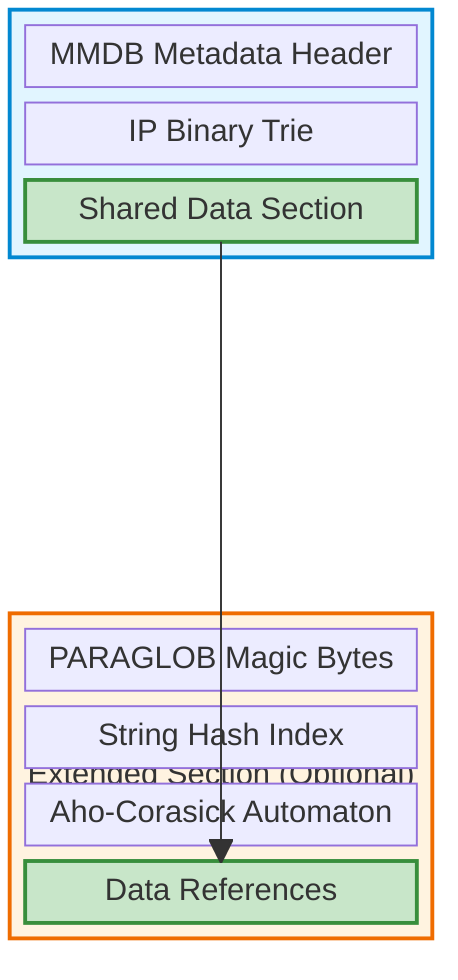
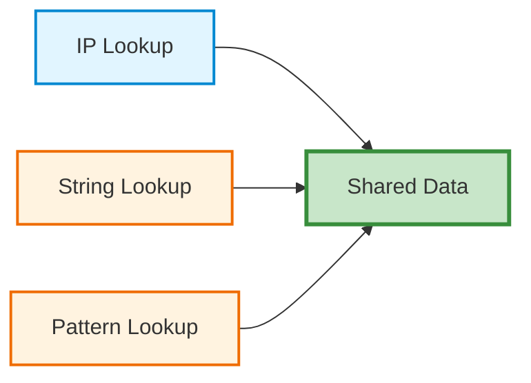
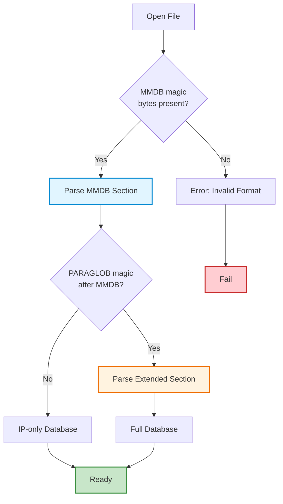

# Matchy Database Format (.mxy)

Matchy's hybrid database format uses the MaxMind DB (MMDB) tree and standard
data encodings, then adds optional indexes for literals and glob patterns.
Matchy reads standard MMDB v2 types within documented decoder resource limits.
Standard MMDB readers can decode Matchy IP values when those values use only
standard types.

The native and compatibility APIs make common GeoIP-style workflows familiar,
but Matchy is not an unlimited or byte-for-byte replacement for every
libmaxminddb behavior. In particular, Matchy's extended `Timestamp` type 128 is
not understood by standard MMDB readers.

The Matchy database format (`.mxy`) achieves this by extending the standard MMDB format to support IP addresses, string literals, and glob patterns in a single unified, memory-mappable database file.

## Design Goals

1. **Standard-type compatibility** - Read MMDB v2 files within bounded decoder limits
2. **Interoperable output** - Standard MMDB tools can read IP values that use standard types
3. **Separate extensions** - Add string/pattern indexes outside tree-referenced data
4. **Predictable query routing** - Keep IP traversal independent of optional text indexes
5. **Single file** - All query types in one memory-mappable database

## File Structure

The `.mxy` format uses a dual-section approach with optional extensions:



### MMDB Section (Always Present)

The base section follows the standard MaxMind DB format:

- **MMDB Metadata Header**: Database configuration, record size, node count
- **IP Binary Trie**: Prefix tree for fast IP address lookups
- **Shared Data Section**: Encoded data values referenced by all query types

### Extended Section (Optional)

When string or pattern matching is needed, an additional section is appended:

- **PARAGLOB Magic Bytes**: 8-byte identifier marking the extended section
- **String Hash Index**: Hash table for exact string literal matching
- **Aho-Corasick Automaton**: Multi-pattern matching for glob expressions
- **Data References**: Offsets pointing back into the shared data section

## Key Innovation: Shared Data Section

The critical design element is that **both sections reference the same data section**:



This means:

- ✅ No data duplication regardless of query type
- ✅ Memory-efficient for databases with mixed query types
- ✅ Single source of truth for all metadata
- ✅ Consistent results across query methods

## Compatibility Matrix

| Database Type | Matchy | libmaxminddb | Notes |
|---------------|--------|--------------|-------|
| Standard MMDB v2 (`.mmdb`) | ✅ Standard types within limits | ✅ | Matchy enforces decoder resource limits |
| IP-only `.mxy`, standard value types | ✅ | ✅ IP lookups | No Matchy-only value types |
| Full `.mxy`, standard IP value types | ✅ | ✅ IP lookups | Text indexes are ignored by libmaxminddb |
| `.mxy` with Matchy `Timestamp` values | ✅ | ⚠️ | Extended type 128 is Matchy-specific |

### Reading Standard MMDB Files

Matchy's native API can open common standard MMDB databases:
```rust
use std::net::IpAddr;

let db = Database::from("GeoLite2-City.mmdb").open()?;
let result = db.lookup_ip("8.8.8.8".parse::<IpAddr>()?)?;
```

### Writing IP-Compatible Databases

IP-only `.mxy` databases whose values use standard types work with existing
MMDB tools:
```bash
# Build database with Matchy
matchy build ips.csv --input-format csv --output geoip.mxy

# Query with libmaxminddb tools
mmdbinspect -db geoip.mxy 8.8.8.8  # Works!

# Query with Matchy for full API
matchy query geoip.mxy 8.8.8.8
```

### Extended Databases

Databases with strings and patterns retain standard-reader IP interoperability
when their IP values use only standard MMDB types:
```bash
# Build database with all query types
matchy build ips.csv domains.csv patterns.csv \
  --input-format csv \
  --output full.mxy

# IP lookups work with both tools
mmdbinspect -db full.mxy 1.2.3.4     # ✅ Works
matchy query full.mxy 1.2.3.4         # ✅ Works

# String/pattern lookups only work with Matchy
matchy query full.mxy "example.com"   # ✅ Works
matchy query full.mxy "*.example.com" # ✅ Works
```

## Implementation Details

### Format Detection Algorithm

Matchy automatically detects the database format on opening:



### Unified API

Regardless of format, the API remains consistent:
```rust
// Single API works for all database types
let db = Database::from("database.mxy").open()?;

// Query based on input type
let ip_result = db.lookup("192.168.1.1")?;      // IP lookup
let str_result = db.lookup("example.com")?;     // String lookup
let glob_result = db.lookup("*.example.com")?;  // Pattern lookup
```

### Memory Mapping

The file is memory-mapped so Matchy can read its indexes in place without deserializing the entire database:

- MMDB references use the bases defined by the MMDB format
- Extension references use the base defined by each extension structure
- Database open validates metadata and top-level section envelopes
- Nested serialized references receive deliberate bounds checks when they are accessed

Those access-time checks are part of the runtime safety model; memory mapping avoids whole-file decoding, not the need to validate each nested reference before use.

## Performance Impact

IP lookup uses the MMDB tree regardless of whether text indexes are present.
Opening a combined file also validates the optional extension envelopes and
retains their runtime views, so “zero overhead” is not an appropriate blanket
claim. Measure open and query behavior with `matchy bench` on the target data,
hardware, storage, and page-cache state.

## See Also

- [Binary Format Details](binary-format.md) - Low-level format specification
- [MMDB Integration](mmdb-integration.md) - Getting started with MMDB compatibility
- [System Architecture](architecture.md) - Overall system design
- [Performance Benchmarks](benchmarks.md) - Detailed performance analysis
